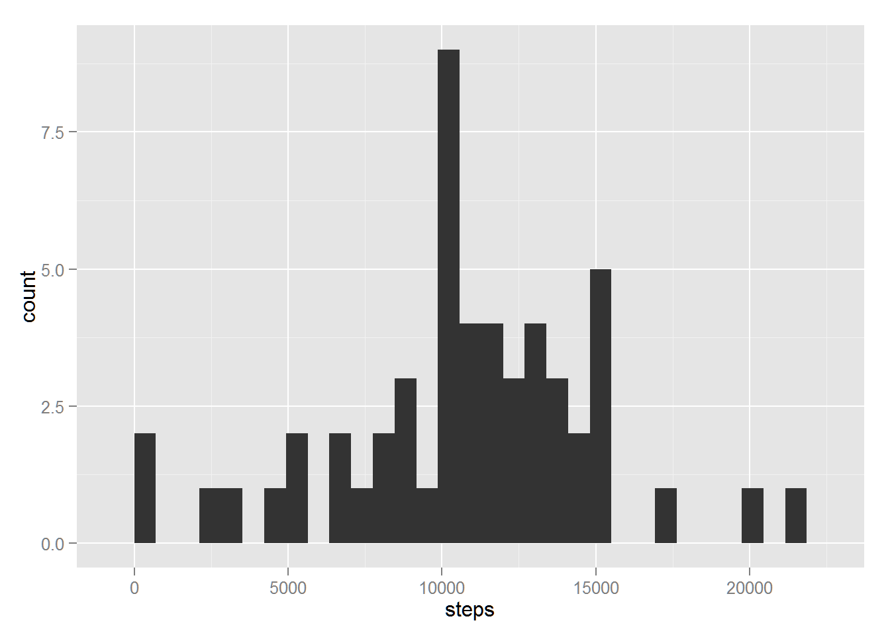
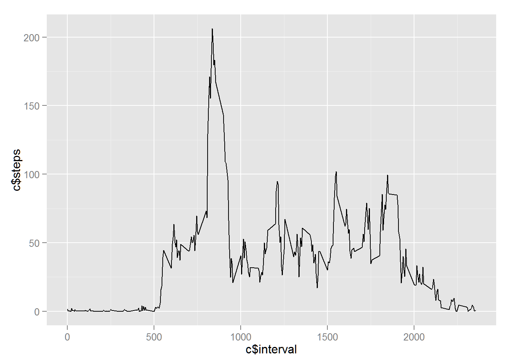
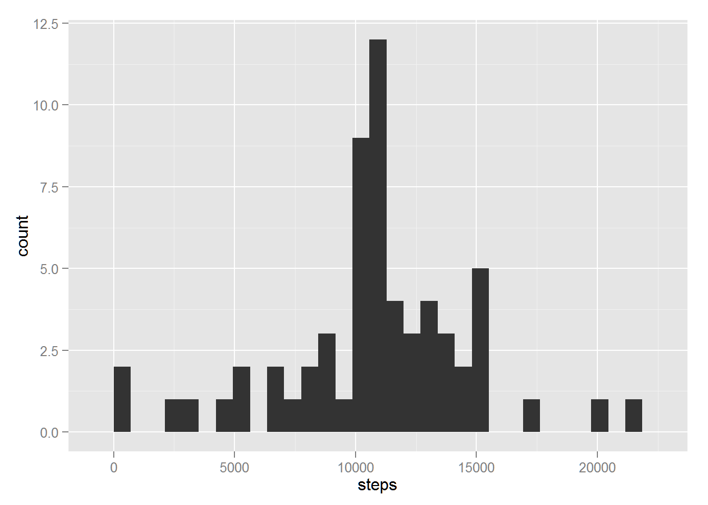
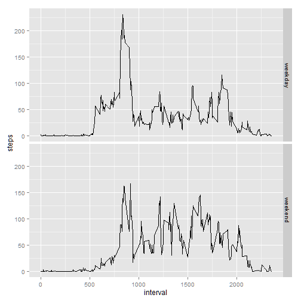

###Configure R environment  

```r
library(knitr)
library(lubridate)
library(reshape2)
library(dplyr)
library(ggplot2)

knitr::opts_chunk$set(echo = TRUE, fig.path = 'figure/plot-', cache = FALSE)
```

###Load and process data

Before we begin to analyze our data, it's essential that we process and prepare our dataset. Of course, to do so, we must first store the dataset in-memory.

The following code will scan the current working directory to check whether the necessary file is present. 
If it is not, it downloads the file from the provided URL before continuing to process. If the file is present, the file is passed to read.csv() and stored within the "active" object. 


```r
fileUrl <- "https://d396qusza40orc.cloudfront.net/repdata%2Fdata%2Factivity.zip"

if(!("activity.zip" %in% list.files())) {
        download.file(fileUrl, "activity.zip", mode="wb")
        unzip("activity.zip")
}

activity <- read.csv("activity.csv")
```

Process/transform the data (if necessary) into a format suitable for your 
analysis


```r
activity$date <- ymd(activity$date)

activityMelt <- melt(activity, measure.vars = "steps")

dailyTotal <- dcast(activityMelt, date ~ variable, sum)
meanInterval <- arrange(dcast(activityMelt, interval ~ variable, mean, na.rm = TRUE), interval)
```
### What is mean total number of steps taken per day?

For this part of the assignment, you can ignore the missing values in
the dataset.

1. Make a histogram of the total number of steps taken each day


```r
ggplot(dailyTotal, aes(x=steps)) + geom_histogram()
```

 

2. Calculate and report the **mean** and **median** total number of steps taken 
per day


```r
mean(dailyTotal$steps, na.rm = TRUE)
```

```
## [1] 10766.19
```

```r
median(dailyTotal$steps, na.rm = TRUE)
```

```
## [1] 10765
```

### What is the average daily activity pattern?

1. Make a time series plot (i.e. `type = "l"`) of the 5-minute interval 
(x-axis) and the average number of steps taken, averaged across all days 
(y-axis)


```r
ggplot(meanInterval, aes(interval, steps)) + geom_line()
```

 

2. Which 5-minute interval, on average across all the days in the dataset, 
contains the maximum number of steps?


```r
meanInterval[(meanInterval$steps == max(meanInterval$steps)), 1]
```

```
## [1] 835
```

###Imputing missing values
1. Calculate and report the total number of missing values in the dataset (i.e. 
the total number of rows with `NA`s)

Missing value:

```r
sum(!complete.cases(activity))
```

```
## [1] 2304
```

2. Devise a strategy for filling in all of the missing values in the dataset. 
The strategy does not need to be sophisticated. For example, you could use the 
mean/median for that day, or the mean for that 5-minute interval, etc.

3. Create a new dataset that is equal to the original dataset but with the 
missing data filled in.


```r
fillByIntervalMeans <- arrange(select(merge(activity[(!complete.cases(activity)), ], meanInterval, by = "interval"), steps.y, date, interval), date, interval)
names(fillByIntervalMeans)[1] <- "steps"
activity[(!complete.cases(activity)), ] <- fillByIntervalMeans

activityMelt <- melt(activity, measure.vars = "steps")

dailyTotal <- dcast(activityMelt, date ~ variable, sum)
```

4. Make a histogram of the total number of steps taken each day and Calculate 
and report the **mean** and **median** total number of steps taken per day. 


```r
ggplot(dailyTotal, aes(x=steps)) + geom_histogram()
```

 

```r
mean(dailyTotal$steps)
```

```
## [1] 10766.19
```

```r
median(dailyTotal$steps)
```

```
## [1] 10766.19
```
Do these values differ from the estimates from the first part of the assignment? 
What is the impact of imputing missing data on the estimates of the total daily 
number of steps?

###Are there differences in activity patterns between weekdays and weekends?

For this part the `weekdays()` function may be of some help here. Use
the dataset with the filled-in missing values for this part.

1. Create a new factor variable in the dataset with two levels -- "weekday" and "weekend" indicating whether a given date is a weekday or weekend day.


```r
week <- mutate(activityMelt, weekday = factor(weekdays(date) %in% c("Saturday", "Sunday"), labels = c("weekday", "weekend")))

weekday <- mutate(dcast(week[(week$weekday == "weekday"), ], interval ~ variable, mean), group = "weekday")
weekend <- mutate(dcast(week[(week$weekday == "weekend"), ], interval ~ variable, mean), group = "weekend")

week <- arrange(rbind(weekday, weekend), interval)
```

1. Make a panel plot containing a time series plot (i.e. `type = "l"`) of the 5-minute interval (x-axis) and the average number of steps taken, averaged across all weekday days or weekend days (y-axis).


```r
ggplot(week, aes(interval, steps)) + geom_line() + facet_grid(group ~ .)
```

 

## Submitting the Assignment

To submit the assignment:

1. Commit your completed `PA1_template.Rmd` file to the `master` branch of your git repository (you should already be on the `master` branch unless you created new ones)

2. Commit your `PA1_template.md` and `PA1_template.html` files produced by processing your R markdown file with the `knit2html()` function in R (from the **knitr** package)

3. If your document has figures included (it should) then they should have been placed in the `figure/` directory by default (unless you overrode the default). Add and commit the `figure/` directory to your git repository.

4. Push your `master` branch to GitHub.

5. Submit the URL to your GitHub repository for this assignment on the course web site.

In addition to submitting the URL for your GitHub repository, you will
need to submit the 40 character SHA-1 hash (as string of numbers from
0-9 and letters from a-f) that identifies the repository commit that
contains the version of the files you want to submit. You can do this
in GitHub by doing the following:

1. Go into your GitHub repository web page for this assignment

2. Click on the "?? commits" link where ?? is the number of commits you have in the repository. For example, if you made a total of 10 commits to this repository, the link should say "10 commits".

3. You will see a list of commits that you have made to this repository. The most recent commit is at the very top. If this represents the version of the files you want to submit, then just click the "copy to clipboard" button on the right hand side that should appear when you hover over the SHA-1 hash. Paste this SHA-1 hash into the course web site when you submit your assignment. If you don't want to use the most recent commit, then go down and find the commit you want and copy the SHA-1 hash.

A valid submission will look something like (this is just an **example**!)

```r
https://github.com/rdpeng/RepData_PeerAssessment1

7c376cc5447f11537f8740af8e07d6facc3d9645
```


