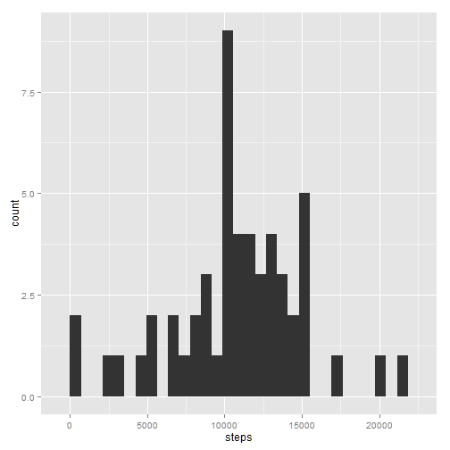
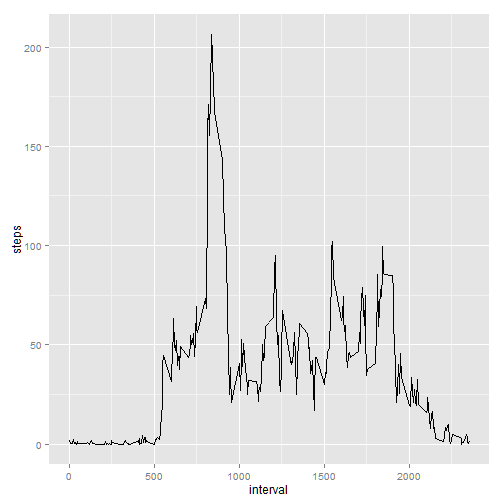
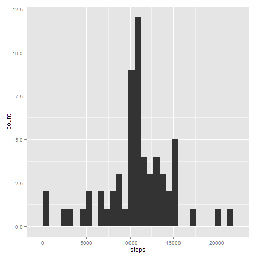
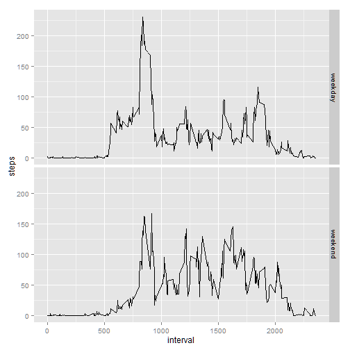

###Configure R environment  

```r
library(knitr)
library(lubridate)
library(reshape2)
library(dplyr)
library(ggplot2)

knitr::opts_chunk$set(echo = TRUE, fig.path = 'figure/plot-', cache = FALSE)
```

###Load and process data
Before we begin to analyze our data, it's essential that we process and prepare our dataset. Of course, to do so, we must first store the dataset in-memory.

The following code will scan the current working directory to check whether the necessary file is present. 
If the file is not, it downloads the file from the provided URL, before continuing to process. If the file is present, it is passed to `read.csv()` and stored within `activity`. 


```r
fileUrl <- "http://d396qusza40orc.cloudfront.net/repdata%2Fdata%2Factivity.zip"

if(!("activity.zip" %in% list.files())) {
        download.file(fileUrl, "activity.zip")
        unzip("activity.zip")
}

activity <- read.csv("./activity.csv")
```

After transforming the date column into the date data type, we can use the reshape2 package to melt the dataframe, casting it into two sub frames:

* `dailyStepCount` summarizes activity levels by computing the total number of steps taken per day
* `meanInterval` summarizes activity levels by computing the mean of each interval over the date range


```r
activity$date <- ymd(activity$date)
activityMelt <- melt(activity, measure.vars = "steps")

dailyStepCount <- dcast(activityMelt, date ~ variable, sum)
```

### Plotting the frequency of daily total steps and visualizing the daily activity pattern
We can then plot the frequency of day's total step count using ggplot2's histogram functionality:


```r
ggplot(dailyStepCount, aes(x=steps)) + geom_histogram()
```

 

Running `mean()` and `median()` on `dailyStepCount` returns:


```r
mean(dailyStepCount$steps, na.rm = TRUE)
```

```
## [1] 10766.19
```

```r
median(dailyStepCount$steps, na.rm = TRUE)
```

```
## [1] 10765
```

To find the average daily activity pattern, we will recast our melted dataframe into `meanInterval`:


```r
meanInterval <- arrange(dcast(activityMelt, interval ~ variable, mean, na.rm = TRUE), interval)
```

Using the ggplot2 line type, the average daily activity pattern can be viewed as a timeseries broken down by interval:


```r
ggplot(meanInterval, aes(interval, steps)) + geom_line()
```

 

Although our timeseries gives us an excellent visualization of the data's overall shape, we'll run `max()` on the `meanInterval` to find the interval with the highest average step count:


```r
meanInterval[(meanInterval$steps == max(meanInterval$steps)), 1]
```

```
## [1] 835
```

###Imputing missing values
`complete.cases()` returns a logical vector, indicating the rows, or observations, that are complete (i.e. no missing values.) When negated, this vector provides the location of every row that is incomplete (i.e. missing a value.) 

A logical vector can be thought of as a collection of 1s and 0s, each indicating True or False, respectively. We can count the number of rows that are missing values, by passing the logical vector to `sum()`:

```r
sum(!complete.cases(activity))
```

```
## [1] 2304
```

Using the same logical vector, we can subset our activity set to obtain a dataframe filled exclusively with incomplete observations. Merging this dataframe with `meanInterval`, the frame that reveals the average steps per interval, we can fill in the missing values using the respective interval's average step count: 

```r
fillByIntervalMeans <- arrange(select(merge(activity[(!complete.cases(activity)), ], meanInterval, by = "interval"), steps.y, date, interval), date, interval)
names(fillByIntervalMeans)[1] <- "steps"
activity[(!complete.cases(activity)), ] <- fillByIntervalMeans

activityMelt <- melt(activity, measure.vars = "steps")

dailyStepCount <- dcast(activityMelt, date ~ variable, sum)
```

An adjusted histogram, mean, and median can easily be calculated:

```r
ggplot(dailyStepCount, aes(x=steps)) + geom_histogram()
```

 

```r
mean(dailyStepCount$steps)
```

```
## [1] 10766.19
```

```r
median(dailyStepCount$steps)
```

```
## [1] 10766.19
```

The adjusted mean statistic is equivalent to the unadjusted mean statistic; however, the adjusted median statistic is greater than the unadjusted median statistic and is equal to the adjusted mean. This is to be expected, as the original exclusion of NA values from consideration would have increased the weight given to each datum in calculating the 50th percentile, skewing the median.

### Weekend activity vs weekday activity
We first create our new factor variable, using `weekdays()` to return the date day of the week. We can split the dataframe in two, based on our weekday factor, calculate the mean of each 5-minute interval, and rbind the sets, making our dataframe whole again:


```r
week <- mutate(activityMelt, weekday = factor(weekdays(date) %in% c("Saturday", "Sunday"), labels = c("weekday", "weekend")))

weekday <- mutate(dcast(week[(week$weekday == "weekday"), ], interval ~ variable, mean), group = "weekday")
weekend <- mutate(dcast(week[(week$weekday == "weekend"), ], interval ~ variable, mean), group = "weekend")

week <- arrange(rbind(weekday, weekend), interval)
```

And thanks again to our new factor, plotting the set proves simple:


```r
ggplot(week, aes(interval, steps)) + geom_line() + facet_grid(group ~ .)
```

 


